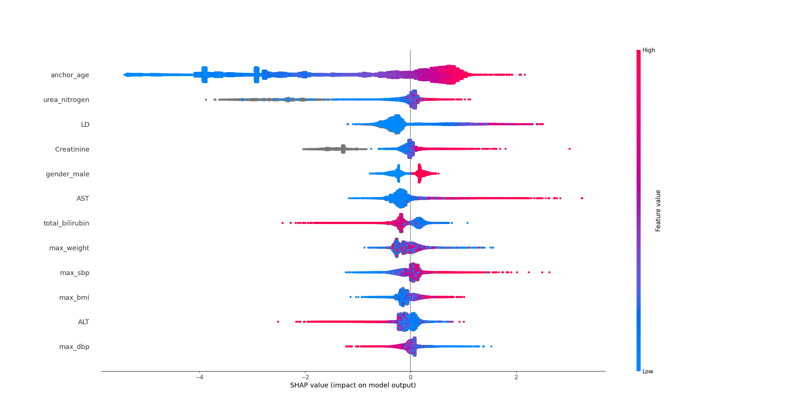

# Machine learning reliably identifies and ranks laboratory and demographic predictors in acute myocardial infarction: a MIMIC-IV study
Shey, Aaron$^1$ and Shey, Jason$^2$
$^1$:University of California, Berkeley
$^2$:West Coast Kidney Institute
## Introduction 

Machine learning has emerged as one of the
most powerful tools for scientific research in the 21st century,
enabling researchers to model nonlinear relationships between multiple
variables. User-friendly software tools such as PyTorch and Tensorflow,
along with consumer access to high-performance computing hardware, have
enabled researchers to build and use machine learning models without
needing years of training. However, machine learning models require
large, high quality datasets to generate meaningful results. Access to
such datasets remains a barrier to research.

Electronic health records (EHRs) are digitized version of the data
surrounding a patient, including their diagnoses, vital signs,
laboratory results, and more. In 2021, a CDC survey found that 88% of
physicians used some form of EHR. Due to its prevalence, EHR has
facilitated the development of large, high-dimensional datasets suitable
for machine learning analysis.

An acute myocardial infarction (AMI) occurs when the myocardium (heart
muscle) experiences an imbalance in oxygen supply and demand, causing a
variety of symptoms such as chest pain, numbness, cardiac muscle
necrosis and eventually death.

In this study, we will seek to construct and explain a machine learning
model for laboratory predictors of acute myocardial infarction.

## Results 

Out of 364,627 total patients in the MIMIC-IV dataset, 16,705 patients
were diagnosed with AMI (ICD 9 sub-codes 410 or ICD 10 sub-codes I21).

The model predicted age as the most important factor, with a SHAP
explainer value of 1.6. The next most important factor was blood urea
nitrogen, with a SHAP explainer value of 0.6. The following three
factors, in order of most significant to least significant, were lactate
dehydrogenase, creatinine, and gender. Gender and AST had similar SHAP
explainer values.

Beeswarm plots were also generated for the SHAP explainer values for all
parameters.

## Discussion 

In this study, we aimed to identify significant demographic and
laboratory values correlated with acute myocardial infarction by
training a machine learning model.

Strong pre-existing literature supports the findings of this machine
learning model. Age is heavily supported by existing studies as a risk
facter for AMI. The long blue-colored tail of the beeswarm plot
indicated that lower age correlated with a lower risk of AMI. However,
higher age had a weaker correlation with risk of AMI.

Blood urea nitrogen (BUN) appears as another value with a strong
positive correlation with AMI.

Lactate dehydrogenase, the third strongest predictor of AMI, shares a
similar distribution with AST.

The SHAP bar and beeswarm plots in conjunction highlighted the efficacy
of the model, with its findings supported by existing medical
literature.

## Methods 

A table with the following values was constructed from the MIMIC IV v3.1
database: age, gender, BMI, weight, blood urea nitrogen, lactate
dehydrogenase, creatinine, aspartate aminotransferase, alanine
aminotransferase, total bilirubin, troponin T, troponin I, blood
pressure. An additional column was added to the table, with 1
representing a diagnoses of AMI, and a 0 representing a different
diagnosis.

In cases where patients had multiple laboratory results, the earliest
value was chosen. In patients with multiple vital signs readings, the
maximum values for BMI, weight, and systolic and diastolic blood
pressures were recorded.

A Python script was developed to identify laboratory values where less
than 20% of patients had recorded values. Only 3% of patients had
troponin I values, and no patients had troponin T values. These values
were removed from the dataset. The resulting dataset was trained with
the XGBoost Python package, with 80% of the dataset used for training,
and 20% used for testing. Explanatory graphs were generated using the
SHAP Python package.

All analyses were performed on a consumer‑grade desktop computer
equipped with an Intel Core Ultra 265F processor, 32 GB of DDR5 RAM, and
an NVIDIA RTX 5080 GPU.

## Acknowledgements 

We acknowledge the cloud computing resources provided by the University
of California, Berkeley, which supported data processing and analysis.

## Author contributions statement 

J.S. conceived the experiment. All authors analyzed the results and
reviewed the manuscript.
